# Hi Engineer, TAF SOLUTIONS 🌐

 

## Module 2 Assignment Website Project

This website is a website project built with HTML & CSS. This project takes the theme IT Generalist 😁

### Structure Website Project

#### Head

Ⓜ📑 Add an icon to the title bar

🔎🔍 Add Meta Tag For SEO

#### Font

V.1 🅰 Use Font Embed

V.2 🔤 Use Font Face

#### Header

1️⃣ Responsive Navbar use hamburger input button type checkbox

2️⃣ Bg Header using keyframes using text and img

#### Main

3️⃣ Service use Flex Card, lil transform n transition

4️⃣ V.1 Grid container image use various effect, just try it

🔨 V.2 Adding Container image more grids using various effects, try it

5️⃣ Card Founder use Keyframes use animation float and responsive image with picture + source + srcset method

##### All use mobile view 📱

## Deployment :
######🖥 Deployment on Github with Netlify

🏳Register on Netlify, then connect to your GitHub account and provide permission to use the repository

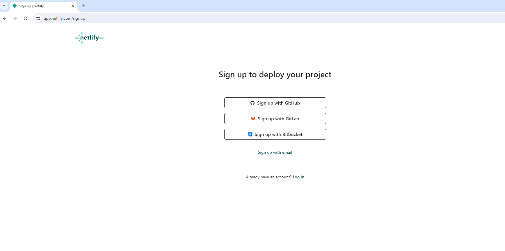

 then add a new website by importing it from the project you created on GitHub.

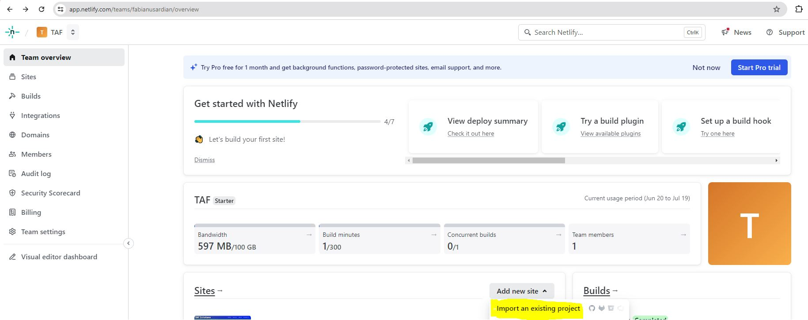
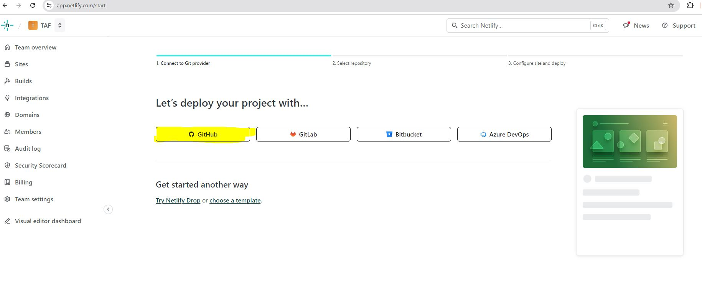

 create a site with the name you want, this is the name of the site that I created on netlify https://tafsolution.netlify.app/

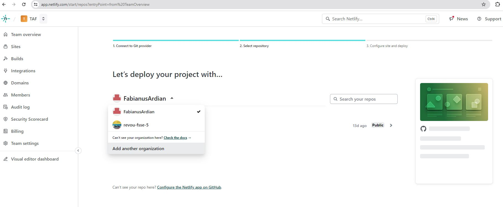

After the site address is created, if you make changes to the data in the repository, any data that is changed will immediately be updated on the site that we have created.

######💻 Connect a Custom Domain and DNS using niagahoster.co.id services

🏳Register on Niagahoster, use Google Acount

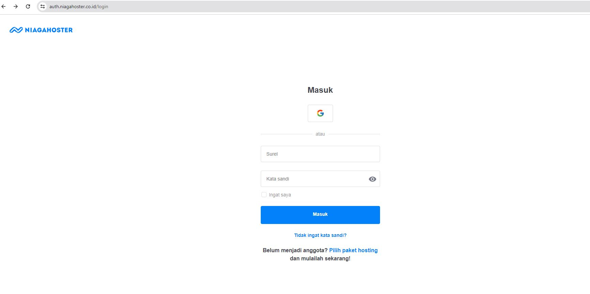

then search for the desired domain name then we pay for the selected domain

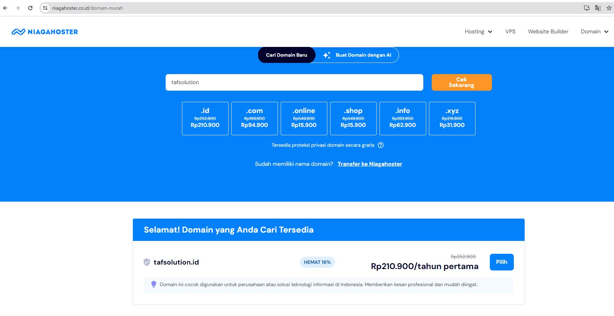

After this you will be directed to the Niagahoster domain management page

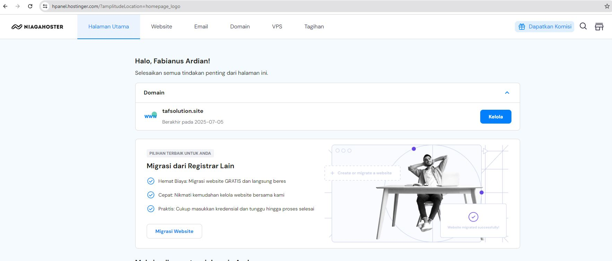

Return to Netlify, go to the section of the site you created

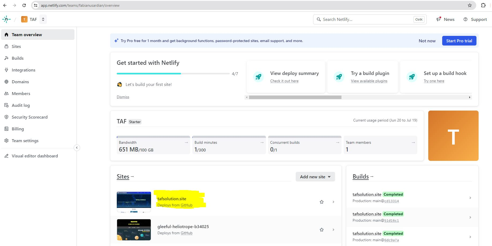

Go to the domain management submenu and add the custom domain that you have purchased

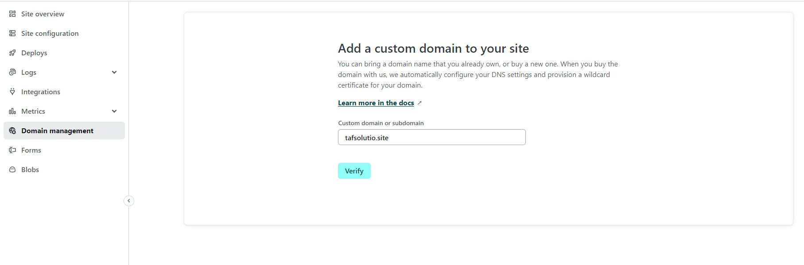

then return to the domain management submenu, select the custom domain that has been added, then select options and select Go To DNS Panel

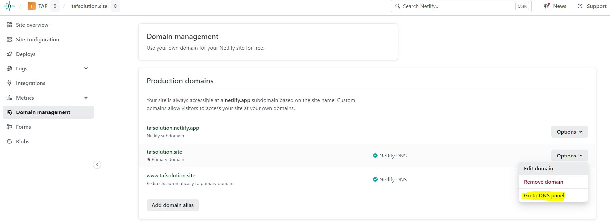

Copy several name servers that have been provided by Netlify to the DNS/Name Server on Niagahoster so that the custom domain that has been added can be accessed

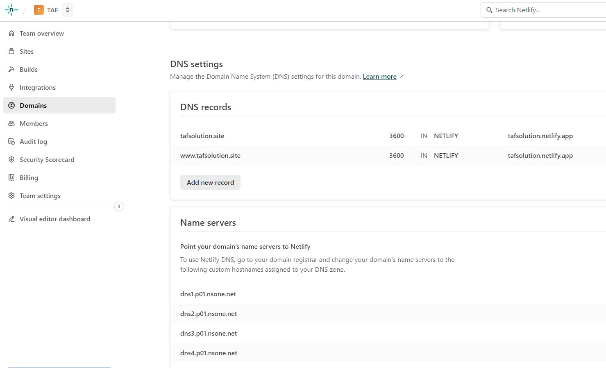

Return to the domain menu on Niagahoster, select the custom domain that you have purchased and go to the DNS/Name Sever submenu.
Go to the DNS Record section, select the server name, then change the server from the Netlify name server, then save

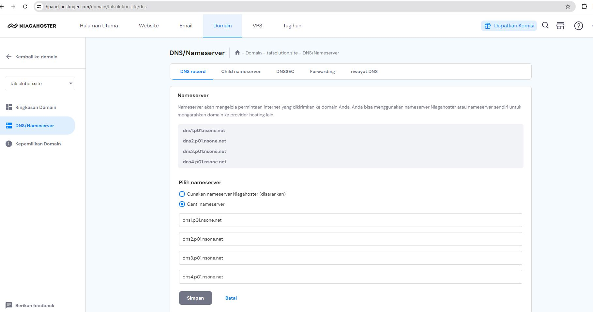

Wait a few moments and the custom domain you have selected can be accessed properly

###### 🌏 https://tafsolution.site/

🙌 From Ardian

👨‍💻 Trying to become a software engineer

